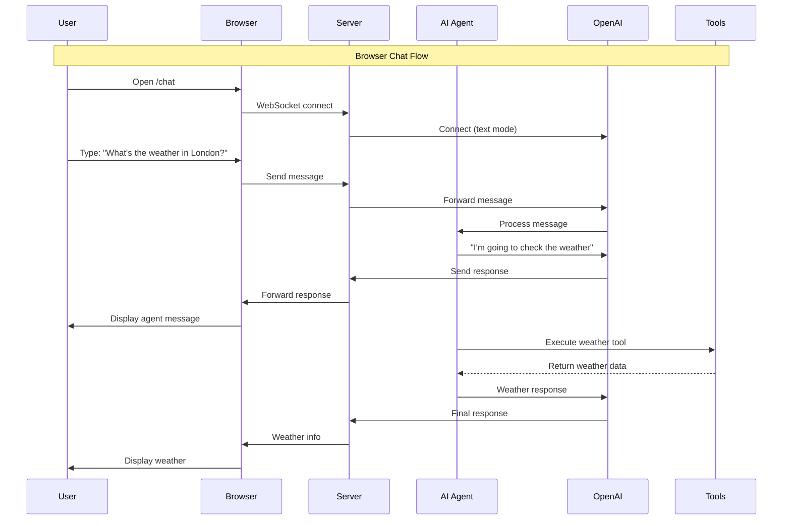
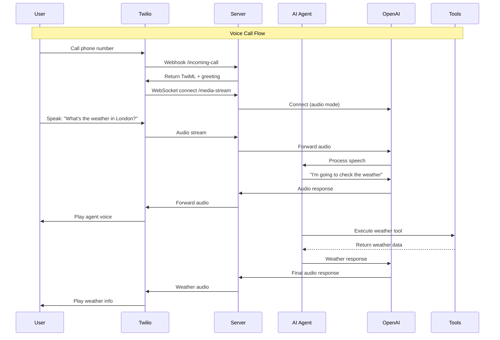
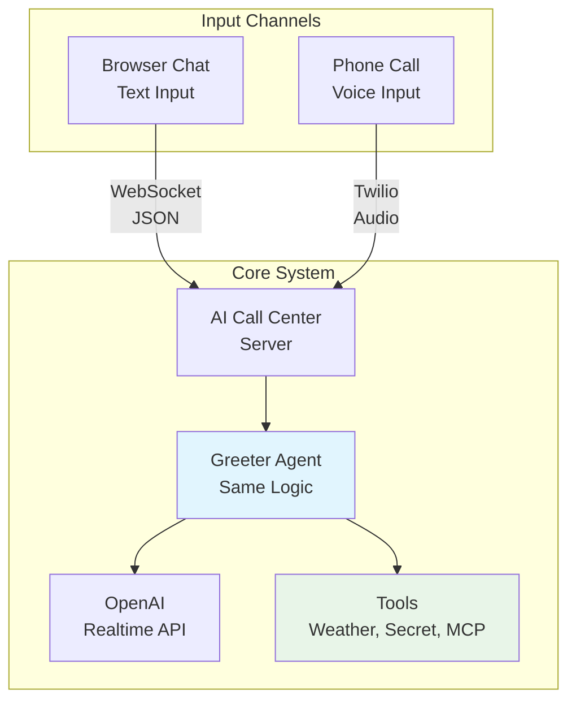
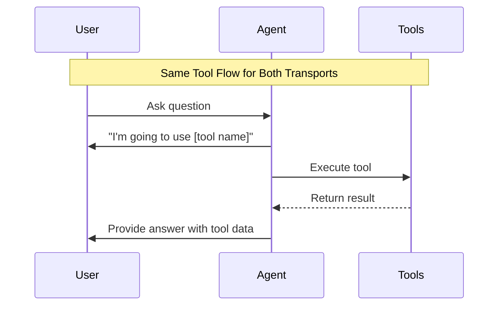

# AI Call Center - Sequence Diagrams (Simplified)

This document contains simplified Mermaid sequence diagrams showing the core interactions in the AI Call Center application.

## Browser Chat Flow

## Twilio Voice Call Flow

## System Architecture Overview

## Core Tool Flow

## Key Points

- **Same Agent Logic**: Both browser and phone use identical AI agent and tools
- **Different I/O**: Browser uses text messages, phone uses voice audio
- **Real-time**: Both provide instant responses via OpenAI Realtime API
- **Independent Sessions**: Each connection gets its own isolated session
- **Tool Announcements**: Agent always announces before using tools
